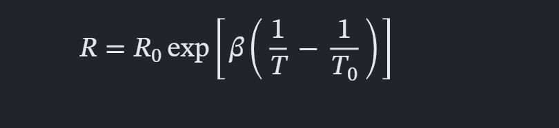
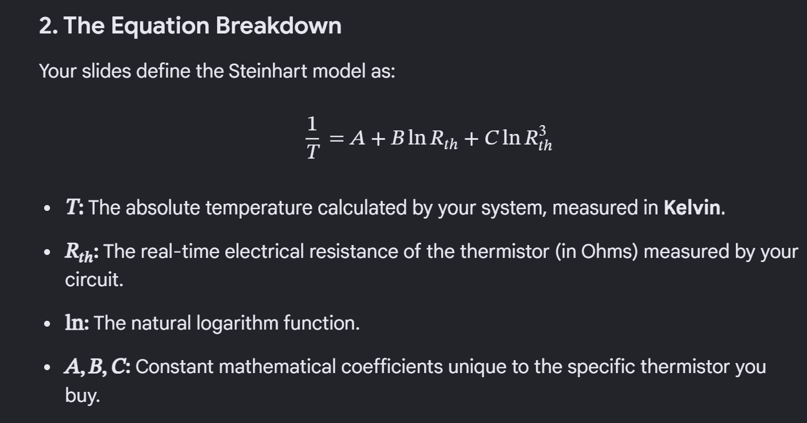
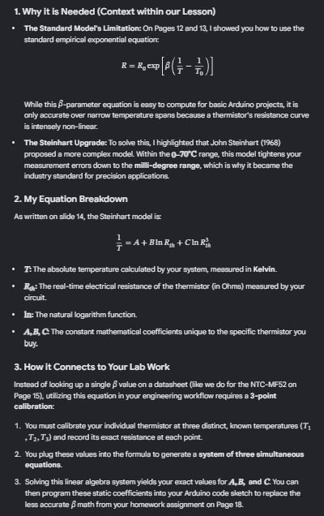

# GEST-3005-Chapter-5-stuff

1. Default State
   1. When an Arduino Uno boots up or resets, all of its pins default to inputs by hardware design.
   2. analogRead() Overrides It AutomaticallyThe analogRead() function specifically handles the configuration of the pin's internal circuitry. The moment the code executes analogRead(A0), the Arduino automatically configures that pin to connect to its internal Analog-to-Digital Converter (ADC) pipeline, ignoring any previous pinMode() settings.
   3. pinMode() is Designed for DigitalThe pinMode() function is primarily intended to set pins for digital operations (INPUT, OUTPUT, or INPUT_PULLUP).Using it on an analog pin does not break anything, but removing that line from your setup() function will result in the exact same performance while  code slightly cleaner.
   4. Important Hardware Constraints ⚠️
      1. **Avoid the C++ Standard Library (STL):** Features like `std::vector`, `std::string`, or `std::list` are missing or highly discouraged because they rely on massive system overhead on Arduino
      2. Limit Dynamic Memory Allocation
      3. **No Advanced RTTI or Exceptions:** Runtime Type Information (RTTI) and `try/catch` exception handling are disabled by default in the compiler to save program storage space.

The **Steinhart–Hart equation** is  =a highly accurate empirical mathematical model used to calculate the relationship between the electrical resistance and temperature of negative temperature coefficient ( **NTC** ) thermistors= . Developed in 1968 by deep-sea researchers John S. Steinhart and Stanley R. Hart, it provides a much more precise temperature conversion across wide spans than simpler alternatives like the B-parameter equation.

## From Lecture slides

1. Why it is Needed (Context within the Lesson)The Standard Model's Limitation: On Page 12 and 13, you use the standard empirical exponential equation:

* **While this **βbeta

  -parameter equation is easy to compute for basic Arduino projects, it is only highly accurate over narrow temperature spans because a thermistor's resistance curve is intensely non-linear.
* **The Steinhart Upgrade:** To solve this, John Steinhart (1968) proposed a more complex model. Within the 0 to 70 celsisus range, the Steinhart model tightens measurement errors down to the  **milli-degree range** **, making it the industry standard for precision applications.**

## What to ADD!!!

- a **circuit photo** and a **T vs time cooling plot** (≥10 points, 5 min spacing). for slide 19...
